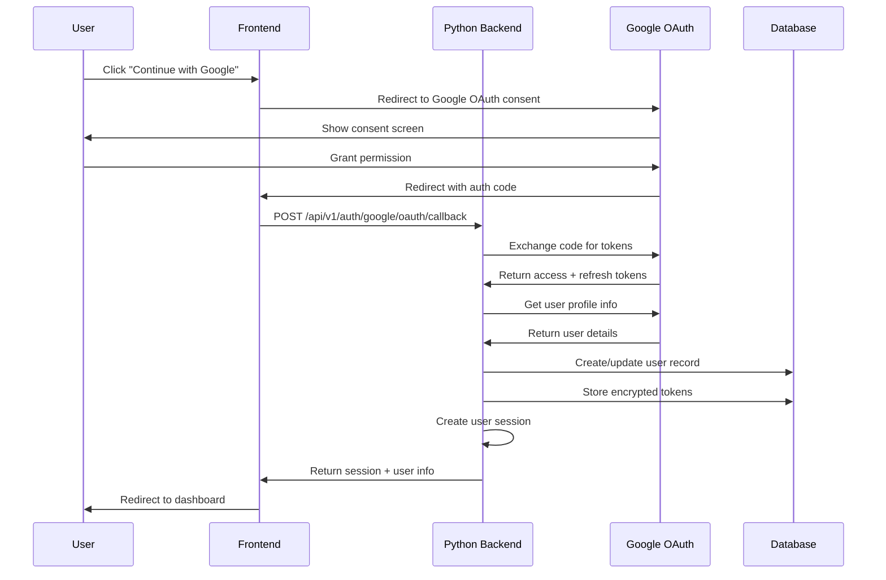
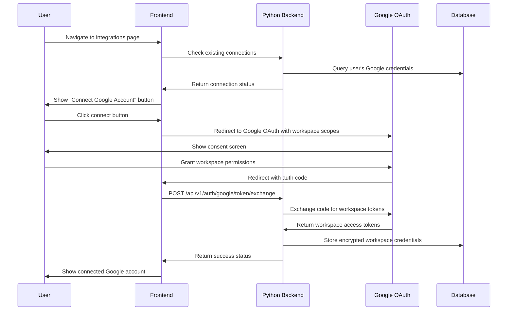

# Google OAuth Master Documentation

## Overview

This document provides comprehensive coverage of Google OAuth implementation in the BeSunny.ai application. The system supports two main use cases:

1. **Google OAuth Login** - Users can sign up and sign in using their Google account
2. **Google Workspace Integration** - Users can connect their Google Workspace (Gmail, Drive, Calendar) for data integration

## Architecture Evolution

### Previous Implementation (Supabase Edge Functions)
- Used Supabase Edge Functions for OAuth token exchange
- Frontend called Edge Functions for secure operations
- Limited to Supabase's serverless constraints

### Current Implementation (Python Backend)
- **Centralized OAuth Management**: All OAuth logic runs in Python backend
- **Enhanced Security**: Better token encryption and session management
- **Scalability**: Can handle higher OAuth request volumes
- **Customization**: Full control over OAuth flow and user management
- **Integration**: Seamless integration with other Python services

## Current Architecture

### Backend Services

#### 1. GoogleOAuthService (`backend/app/services/auth/google_oauth_service.py`)
**Core OAuth Flow Management:**
- Handles OAuth callback with authorization code
- Exchanges code for access/refresh tokens
- Creates or updates user accounts
- Manages user sessions
- Handles account linking and disconnection

**Key Methods:**
- `handle_oauth_callback(code: str)` - Main OAuth callback processor
- `exchange_code_for_tokens(code: str)` - Token exchange with Google
- `_get_user_info(access_token: str)` - Retrieve user profile from Google
- `_create_or_update_user(user_info, tokens)` - User account management
- `_create_user_session(user_id: str, tokens)` - Session creation

#### 2. GoogleTokenService (`backend/app/services/auth/google_token_service.py`)
**Token Lifecycle Management:**
- Refreshes expired access tokens
- Validates token validity
- Manages token storage and encryption
- Handles token exchange operations

**Key Methods:**
- `refresh_user_tokens(user_id: str)` - Refresh tokens for a user
- `validate_token(token: str)` - Validate token authenticity
- `exchange_token(refresh_token: str)` - Exchange refresh token for new access token

#### 3. GoogleDisconnectService (`backend/app/services/auth/google_disconnect_service.py`)
**Account Management:**
- Handles Google account disconnection
- Cleans up stored credentials
- Manages account linking status

### API Endpoints

#### OAuth Flow Endpoints
- **`POST /api/v1/auth/google/oauth/callback`** - Main OAuth callback handler
- **`POST /api/v1/auth/google/oauth/refresh`** - Token refresh endpoint
- **`GET /api/v1/auth/google/user-info`** - Get Google user information
- **`POST /api/v1/auth/google/session`** - Create new OAuth session

#### Workspace Integration Endpoints
- **`POST /api/v1/auth/google/token/exchange`** - Exchange tokens for workspace access
- **`DELETE /api/v1/auth/google/disconnect`** - Disconnect Google account

### Database Schema

#### google_credentials Table
```sql
CREATE TABLE google_credentials (
  user_id UUID PRIMARY KEY REFERENCES users(id),
  access_token TEXT NOT NULL,
  refresh_token TEXT NOT NULL,
  token_type TEXT DEFAULT 'Bearer',
  expires_at TIMESTAMP NOT NULL,
  scope TEXT NOT NULL,
  google_email TEXT,
  google_user_id TEXT,
  google_name TEXT,
  google_picture TEXT,
  login_provider BOOLEAN DEFAULT false,
  login_created_at TIMESTAMP,
  created_at TIMESTAMP DEFAULT now(),
  updated_at TIMESTAMP DEFAULT now()
);
```

#### users Table Integration
```sql
CREATE TABLE users (
  id UUID PRIMARY KEY DEFAULT gen_random_uuid(),
  email TEXT UNIQUE NOT NULL,
  google_id TEXT UNIQUE,
  name TEXT,
  avatar_url TEXT,
  created_at TIMESTAMP DEFAULT now(),
  updated_at TIMESTAMP DEFAULT now()
);
```

## OAuth Flow Implementation

### 1. Google OAuth Login Flow



**Steps:**
1. User clicks "Continue with Google" on login/signup page
2. Frontend redirects to Google OAuth consent screen with appropriate scopes
3. Google redirects back to `/oauth-login-callback` with authorization code
4. Frontend calls Python backend with the authorization code
5. Backend exchanges code for tokens using Google's token endpoint
6. Backend retrieves user profile information from Google
7. Backend creates or updates user account in database
8. Backend creates user session and returns authentication data
9. User is redirected to dashboard with active session

### 2. Google Workspace Integration Flow



**Steps:**
1. User navigates to integrations page
2. Backend checks existing Google connections
3. If no connection exists, user sees "Connect Google Account" button
4. User is redirected to Google OAuth with workspace scopes
5. Google redirects back with authorization code
6. Frontend calls backend to exchange code for workspace tokens
7. Backend stores encrypted workspace credentials
8. User can now access Gmail, Drive, and Calendar data

## Configuration

### Environment Variables

#### Backend Configuration
```env
# Google OAuth Configuration
GOOGLE_CLIENT_ID=your_google_client_id
GOOGLE_CLIENT_SECRET=your_google_client_secret
GOOGLE_PROJECT_ID=your_google_project_id
GOOGLE_LOGIN_REDIRECT_URI=https://your-domain.com/oauth-login-callback

# Database Configuration
DATABASE_URL=your_database_connection_string
SUPABASE_URL=https://your-project.supabase.co
SUPABASE_SERVICE_ROLE_KEY=your_service_role_key

# Security Configuration
SECRET_KEY=your_secret_key_here
ALGORITHM=HS256
ACCESS_TOKEN_EXPIRE_MINUTES=30
```

#### Frontend Configuration
```env
# Google OAuth Configuration
VITE_GOOGLE_CLIENT_ID=your_google_client_id

# Backend API Configuration
VITE_PYTHON_BACKEND_URL=https://your-backend-domain.com

# Supabase Configuration (for user management)
VITE_SUPABASE_URL=https://your-project.supabase.co
VITE_SUPABASE_ANON_KEY=your_anon_key
```

### Google Cloud Console Setup

#### 1. Create OAuth 2.0 Client
1. Go to [Google Cloud Console](https://console.cloud.google.com/)
2. Select your project
3. Navigate to "APIs & Services" > "Credentials"
4. Click "Create Credentials" > "OAuth 2.0 Client IDs"
5. Configure OAuth consent screen if prompted

#### 2. Configure OAuth Consent Screen
- **User Type**: External (for public apps) or Internal (for Google Workspace)
- **App Information**: Name, user support email, developer contact
- **Scopes**: Add required scopes:
  - **Login Scopes**: `userinfo.email`, `userinfo.profile`
  - **Workspace Scopes**: `gmail.modify`, `drive`, `calendar`

#### 3. Add Authorized Redirect URIs
```
# For OAuth Login
https://your-domain.com/oauth-login-callback

# For Workspace Integration
https://your-domain.com/integrations

# For Local Development
http://localhost:3000/oauth-login-callback
http://localhost:3000/integrations
```

## Frontend Components

### Core Components

#### 1. AuthProvider (`src/providers/AuthProvider.tsx`)
**Google Sign-In Management:**
- `signInWithGoogle()` - Initiates Google OAuth flow
- Generates OAuth URL with proper scopes
- Handles OAuth state management

#### 2. OAuthLoginCallback (`src/pages/oauth-login-callback.tsx`)
**OAuth Callback Processing:**
- Handles Google OAuth callback
- Calls Python backend for token exchange
- Manages authentication flow completion
- Sets up user session

#### 3. IntegrationsPage (`src/pages/integrations.tsx`)
**Workspace Integration Management:**
- Shows Google connection status
- Handles workspace integration OAuth flow
- Manages account disconnection
- Displays connected services

### Component Integration

```typescript
// Example: Google Sign-In Button
const handleGoogleSignIn = async () => {
  const { error } = await signInWithGoogle();
  if (error) {
    console.error('Google sign-in failed:', error);
  }
};

// Example: OAuth Callback Processing
const handleOAuthCallback = async (code: string) => {
  const response = await fetch(
    `${import.meta.env.VITE_PYTHON_BACKEND_URL}/api/v1/auth/google/oauth/callback`,
    {
      method: 'POST',
      headers: { 'Content-Type': 'application/json' },
      body: JSON.stringify({ code }),
    }
  );
  
  const result = await response.json();
  if (result.success) {
    // Handle successful authentication
  }
};
```

## Security Features

### 1. Token Security
- **Encryption**: Access tokens stored encrypted in database
- **Scope Separation**: Different OAuth scopes for login vs. workspace
- **Token Rotation**: Automatic refresh token management
- **Secure Storage**: Credentials stored in secure database with RLS

### 2. Authentication & Authorization
- **JWT Validation**: All API endpoints require valid JWT tokens
- **User Isolation**: Users can only access their own credentials
- **Session Management**: Secure session creation and validation
- **Account Linking**: Secure linking of existing accounts to Google OAuth

### 3. OAuth Security
- **State Parameter**: OAuth state validation (recommended enhancement)
- **Scope Validation**: Strict scope checking for different use cases
- **Token Validation**: Regular token validity checks
- **Secure Callbacks**: HTTPS-only callback URLs

## Error Handling

### Common Error Scenarios

#### 1. OAuth Errors
```python
# Invalid authorization code
if not code:
    return {
        'success': False,
        'error': 'Authorization code is required'
    }

# Token exchange failure
if not tokens:
    return {
        'success': False,
        'error': 'Failed to exchange code for tokens'
    }
```

#### 2. User Management Errors
```python
# User creation failure
if not user_id:
    return {
        'success': False,
        'error': 'Failed to create or update user'
    }

# Session creation failure
if not session:
    return {
        'success': False,
        'error': 'Failed to create user session'
    }
```

#### 3. Frontend Error Handling
```typescript
try {
  const result = await handleOAuthCallback(code);
  if (!result.success) {
    setError(result.error || 'Authentication failed');
    return;
  }
} catch (error) {
  setError('Unexpected error during authentication');
  console.error('OAuth error:', error);
}
```

## Testing

### Test Scenarios

#### 1. OAuth Flow Testing
- [ ] Test Google OAuth login flow end-to-end
- [ ] Test account linking (existing email + Google OAuth)
- [ ] Test workspace integration for OAuth login users
- [ ] Test scope updates and reconnection flows

#### 2. Error Handling Testing
- [ ] Test invalid authorization codes
- [ ] Test expired tokens
- [ ] Test network failures during token exchange
- [ ] Test database connection failures

#### 3. Security Testing
- [ ] Test JWT validation on protected endpoints
- [ ] Test user isolation (users can't access others' credentials)
- [ ] Test token encryption and storage
- [ ] Test session management and expiration

### Testing Tools
- **Postman/Insomnia**: API endpoint testing
- **Google OAuth Playground**: OAuth flow testing
- **Database Tools**: Credential storage verification
- **Browser DevTools**: Frontend OAuth flow debugging

## Monitoring & Logging

### Logging Strategy
```python
# OAuth callback logging
logger.info("Processing OAuth callback")
logger.info(f"OAuth callback completed successfully for user {user_id}")
logger.error(f"OAuth callback failed: {e}")

# Token operations logging
logger.info("Successfully exchanged refresh token for new access token")
logger.error(f"Failed to exchange token: {e}")
```

### Monitoring Metrics
- OAuth callback success/failure rates
- Token refresh success rates
- User authentication patterns
- API endpoint performance
- Database operation success rates

## Deployment

### Production Considerations

#### 1. Environment Configuration
- Use production Google OAuth credentials
- Configure production redirect URIs
- Set appropriate CORS origins
- Use production database connections

#### 2. Security Hardening
- Enable HTTPS for all OAuth callbacks
- Implement rate limiting on OAuth endpoints
- Set up monitoring and alerting
- Regular security audits

#### 3. Scaling Considerations
- Database connection pooling
- Redis caching for session management
- Load balancing for high-traffic scenarios
- Monitoring and auto-scaling

## Troubleshooting

### Common Issues

#### 1. OAuth Configuration Issues
**Problem**: "Invalid redirect URI" error
**Solution**: Verify redirect URIs in Google Cloud Console match exactly

**Problem**: "Invalid client ID" error
**Solution**: Check environment variables and Google OAuth configuration

#### 2. Token Exchange Issues
**Problem**: "Failed to exchange code for tokens"
**Solution**: Verify client secret and redirect URI configuration

**Problem**: "Invalid grant type" error
**Solution**: Check OAuth flow implementation and token request format

#### 3. Database Issues
**Problem**: "Failed to create user session"
**Solution**: Verify database connection and table schema

**Problem**: "User not found" error
**Solution**: Check user creation logic and database permissions

### Debug Steps
1. Check backend logs for detailed error messages
2. Verify environment variable configuration
3. Test OAuth flow with Google OAuth Playground
4. Check database connectivity and schema
5. Verify frontend callback URL configuration

## Future Enhancements

### Planned Improvements

#### 1. Security Enhancements
- OAuth state parameter implementation
- Enhanced token encryption
- Rate limiting on OAuth endpoints
- Audit logging for OAuth operations

#### 2. User Experience
- Progressive OAuth scopes (request minimal scopes first)
- Better error messages and user guidance
- OAuth flow analytics and insights
- Multi-account Google integration

#### 3. Technical Improvements
- Redis-based session management
- OAuth flow caching and optimization
- Enhanced monitoring and alerting
- Automated token refresh management

### Integration Opportunities
- **Single Sign-On (SSO)**: Enterprise SSO integration
- **Multi-Provider OAuth**: Support for other OAuth providers
- **Advanced Analytics**: OAuth usage analytics and insights
- **Compliance Features**: GDPR and SOC2 compliance tools

## Conclusion

The current Google OAuth implementation provides a robust, secure, and scalable foundation for both user authentication and Google Workspace integration. The migration from Supabase Edge Functions to a Python backend has enabled:

- **Better Security**: Enhanced token encryption and session management
- **Improved Scalability**: Higher throughput and better resource utilization
- **Enhanced Customization**: Full control over OAuth flow and user management
- **Better Integration**: Seamless integration with other backend services

The system is production-ready and provides a solid foundation for future enhancements and integrations.
