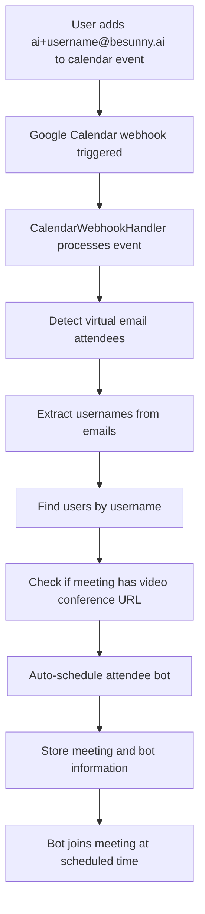

# Virtual Email Attendee Implementation

This document describes the complete implementation of the virtual email attendee functionality for BeSunny.ai, which automatically detects when users add their `ai+{username}@besunny.ai` email alias to calendar events and schedules attendee bots to join those meetings.

## Overview

The virtual email attendee system provides a seamless way for users to automatically schedule AI-powered meeting bots by simply adding their virtual email address to calendar events. When a user adds `ai+{username}@besunny.ai` to a calendar event that has a Google Meet (or other video conference) URL, the system:

1. **Detects the virtual email attendee** in the calendar event
2. **Extracts the username** from the email address
3. **Associates it with the correct user account**
4. **Automatically schedules an attendee bot** to join the meeting
5. **Stores the meeting and bot information** in the database
6. **Tracks the bot's progress** through the meeting lifecycle

## Architecture

### Core Components

1. **VirtualEmailAttendeeService** (`backend/app/services/attendee/virtual_email_attendee_service.py`)
   - Main service for processing virtual email attendees
   - Handles username extraction and user association
   - Manages bot scheduling workflow

2. **Enhanced CalendarWebhookHandler** (`backend/app/services/calendar/calendar_webhook_handler.py`)
   - Processes Google Calendar webhook notifications
   - Detects virtual email attendees in calendar events
   - Triggers auto-scheduling of attendee bots

3. **AttendeeService** (`backend/app/services/attendee/attendee_service.py`)
   - Core service for attendee bot management
   - Integrates with Attendee.dev API
   - Handles bot creation and configuration

4. **AttendeePollingCron** (`backend/app/services/attendee/attendee_polling_cron.py`)
   - Scheduled cron jobs for processing virtual emails
   - Polls attendee bots for status updates
   - Manages automated workflows

### Database Schema

The system uses several tables to track virtual email attendees and bot scheduling:

#### Meetings Table
```sql
CREATE TABLE meetings (
    id UUID PRIMARY KEY DEFAULT gen_random_uuid(),
    user_id UUID NOT NULL REFERENCES users(id) ON DELETE CASCADE,
    title TEXT NOT NULL,
    description TEXT,
    start_time TIMESTAMP WITH TIME ZONE NOT NULL,
    end_time TIMESTAMP WITH TIME ZONE NOT NULL,
    meeting_url TEXT,
    google_calendar_event_id TEXT,
    project_id UUID REFERENCES projects(id) ON DELETE CASCADE,
    attendee_bot_id UUID REFERENCES bots(id),
    bot_name TEXT DEFAULT 'Sunny AI Notetaker',
    bot_status TEXT DEFAULT 'pending' CHECK (bot_status = ANY (ARRAY['pending', 'bot_scheduled', 'bot_joined', 'transcribing', 'completed', 'failed'])),
    event_status TEXT DEFAULT 'needsAction' CHECK (event_status = ANY (ARRAY['accepted', 'declined', 'tentative', 'needsAction'])),
    bot_configuration JSONB,
    bot_deployment_method TEXT DEFAULT 'manual',
    bot_chat_message TEXT DEFAULT 'Hi, I''m here to transcribe this meeting!',
    auto_bot_notification_sent BOOLEAN DEFAULT false,
    auto_scheduled_via_email BOOLEAN DEFAULT false,
    virtual_email_attendee TEXT,
    transcript TEXT,
    transcript_url TEXT,
    transcript_audio_url TEXT,
    transcript_recording_url TEXT,
    transcript_summary TEXT,
    transcript_duration_seconds INTEGER,
    transcript_language TEXT DEFAULT 'en-US',
    transcript_metadata JSONB,
    transcript_participants JSONB,
    transcript_speakers JSONB,
    transcript_segments JSONB,
    transcript_retrieved_at TIMESTAMP WITH TIME ZONE,
    last_polled_at TIMESTAMP WITH TIME ZONE,
    next_poll_time TIMESTAMP WITH TIME ZONE,
    created_at TIMESTAMP WITH TIME ZONE DEFAULT now(),
    updated_at TIMESTAMP WITH TIME ZONE DEFAULT now(),
    UNIQUE(user_id, google_calendar_event_id)
);
```

#### Meeting Bots Table
```sql
CREATE TABLE meeting_bots (
    id UUID PRIMARY KEY DEFAULT gen_random_uuid(),
    bot_id TEXT NOT NULL UNIQUE,
    user_id UUID NOT NULL REFERENCES users(id) ON DELETE CASCADE,
    meeting_url TEXT NOT NULL,
    bot_name TEXT NOT NULL,
    status TEXT DEFAULT 'created',
    attendee_project_id TEXT,
    is_recording BOOLEAN DEFAULT false,
    is_paused BOOLEAN DEFAULT false,
    created_at TIMESTAMP WITH TIME ZONE DEFAULT now(),
    updated_at TIMESTAMP WITH TIME ZONE DEFAULT now()
);
```

#### Cron Execution Logs Table
```sql
CREATE TABLE cron_execution_logs (
    id UUID PRIMARY KEY DEFAULT gen_random_uuid(),
    execution_id TEXT NOT NULL UNIQUE,
    job_type TEXT NOT NULL,
    users_processed INTEGER DEFAULT 0,
    meetings_processed INTEGER DEFAULT 0,
    bots_scheduled INTEGER DEFAULT 0,
    execution_time_ms NUMERIC(10,2),
    status TEXT NOT NULL,
    error_message TEXT,
    executed_at TIMESTAMP WITH TIME ZONE DEFAULT now(),
    created_at TIMESTAMP WITH TIME ZONE DEFAULT now()
);
```

## Complete Workflow

### 1. Calendar Event Creation/Update

When a user creates or updates a calendar event with virtual email attendees:



### 2. Virtual Email Attendee Detection

The system scans calendar event attendees for the pattern `ai+{username}@besunny.ai`:

```python
def _extract_virtual_email_attendees(self, event_data: Dict[str, Any]) -> List[Dict[str, Any]]:
    virtual_attendees = []
    
    # Pattern to match ai+{username}@besunny.ai
    virtual_email_pattern = r'ai\+([^@]+)@besunny\.ai'
    
    for attendee in event_data.get('attendees', []):
        if isinstance(attendee, dict) and attendee.get('email'):
            email = attendee['email']
            match = re.search(virtual_email_pattern, email)
            
            if match:
                username = match.group(1)
                virtual_attendees.append({
                    'email': email,
                    'username': username,
                    'response_status': attendee.get('responseStatus', 'needsAction'),
                    'self': attendee.get('self', False),
                    'organizer': attendee.get('organizer', False)
                })
    
    return virtual_attendees
```

### 3. Meeting URL Detection

The system supports multiple video conference platforms:

- **Google Meet**: Extracted from `conferenceData.entryPoints` or description
- **Zoom**: Detected in description with pattern `https://zoom.us/j/\d+`
- **Microsoft Teams**: Detected in description with pattern `https://teams.microsoft.com/l/meetup-join/[^\s]+`
- **Jitsi**: Detected in description with pattern `https://meet.jitsi.net/[^\s]+`
- **Whereby**: Detected in description with pattern `https://app.whereby.com/[^\s]+`

### 4. Bot Auto-Scheduling

When a virtual email attendee is detected in a video conference event:

```python
async def _auto_schedule_bot_for_virtual_email(self, meeting_id: str, virtual_attendee: Dict[str, Any], event_data: Dict[str, Any]):
    username = virtual_attendee['username']
    virtual_email = virtual_attendee['email']
    
    # Find user by username
    user = await self._get_user_by_username(username)
    if not user:
        return
    
    # Check if bot is already scheduled
    existing_bot = await self._check_existing_bot(meeting_id, user['id'])
    if existing_bot:
        return
    
    # Extract meeting URL and verify it's a video conference
    meeting_url = self._extract_meeting_url(event_data)
    if not meeting_url or not self._is_video_conference_url(meeting_url):
        return
    
    # Schedule attendee bot using Attendee.dev API
    bot_result = await self._schedule_attendee_bot(user['id'], meeting_url, event_data, attendee)
    
    if bot_result.get('success'):
        # Store meeting record with bot information
        meeting_id = await self._store_meeting_with_bot(event_data, user['id'], bot_result, attendee)
```

### 5. Bot Configuration

The system automatically configures bots with sensible defaults:

```python
bot_options = {
    'meeting_url': meeting_url,
    'bot_name': 'Sunny AI Notetaker',
    'bot_chat_message': 'Hi, I\'m here to transcribe this meeting!'
}
```

## API Endpoints

### Virtual Email Processing

#### Process Calendar Event
```http
POST /api/v1/attendee/virtual-email/process-event
Content-Type: application/json
Authorization: Bearer {token}

{
    "event_data": {
        "id": "calendar_event_id",
        "summary": "Team Meeting",
        "description": "Join via: https://meet.google.com/abc-defg-hij",
        "start": {"dateTime": "2024-01-15T10:00:00Z"},
        "end": {"dateTime": "2024-01-15T11:00:00Z"},
        "attendees": [
            {"email": "ai+username@besunny.ai", "responseStatus": "accepted"}
        ]
    }
}
```

#### Get Virtual Email Activity
```http
GET /api/v1/attendee/virtual-email/activity?days=30
Authorization: Bearer {token}
```

#### Auto-Schedule Bots
```http
POST /api/v1/attendee/virtual-email/auto-schedule
Authorization: Bearer {token}
```

## Cron Jobs

### Virtual Email Processing Cron

Runs periodically to process calendar events with virtual email attendees:

```python
@celery_app.task
def run_virtual_email_processing_cron():
    """Celery task to run virtual email processing cron job."""
    try:
        cron_service = AttendeePollingCron()
        result = asyncio.run(cron_service.run_virtual_email_processing_cron())
        return result
    except Exception as e:
        logger.error(f"Virtual email processing cron task failed: {e}")
        return {'success': False, 'error': str(e)}
```

### Attendee Bot Polling Cron

Polls active attendee bots for status updates and transcript retrieval:

```python
@celery_app.task
def run_attendee_bot_polling_cron():
    """Celery task to run attendee bot polling cron job."""
    try:
        cron_service = AttendeePollingCron()
        result = asyncio.run(cron_service.run_attendee_bot_polling_cron())
        return result
    except Exception as e:
        logger.error(f"Attendee bot polling cron task failed: {e}")
        return {'success': False, 'error': str(e)}
```

## Configuration

### Environment Variables

```env
# Attendee.dev API Configuration
ATTENDEE_API_BASE_URL=https://app.attendee.dev
MASTER_ATTENDEE_API_KEY=your_attendee_api_key

# Webhook Configuration
WEBHOOK_BASE_URL=https://your-domain.com

# Virtual Email Domain
VIRTUAL_EMAIL_DOMAIN=besunny.ai
```

### Celery Beat Schedule

```python
# In celery_app.py
app.conf.beat_schedule = {
    'virtual-email-processing': {
        'task': 'app.services.attendee.attendee_polling_cron.run_virtual_email_processing_cron',
        'schedule': crontab(minute='*/15'),  # Every 15 minutes
    },
    'attendee-bot-polling': {
        'task': 'app.services.attendee.attendee_polling_cron.run_attendee_bot_polling_cron',
        'schedule': crontab(minute='*/5'),   # Every 5 minutes
    },
}
```

## Testing

### Running Tests

```bash
cd backend
python test_virtual_email_attendee_functionality.py
```

### Test Coverage

The test suite covers:

1. **Virtual Email Attendee Detection**: Tests username extraction from email addresses
2. **Meeting URL Extraction**: Tests detection of various video conference URLs
3. **Video Conference URL Detection**: Tests validation of meeting URLs
4. **Complete Workflow**: Tests end-to-end virtual email processing
5. **Activity Tracking**: Tests virtual email activity monitoring
6. **Edge Cases**: Tests various username formats and edge cases

## Security Considerations

### Input Validation

- Username extraction uses regex patterns to prevent injection attacks
- Email addresses are validated before processing
- Meeting URLs are validated to ensure they're legitimate video conference links

### Authentication & Authorization

- All API endpoints require valid JWT authentication
- Users can only access their own virtual email activity
- Row-level security (RLS) is enforced on database tables

### Rate Limiting

- API endpoints include rate limiting to prevent abuse
- Cron jobs have built-in retry logic with exponential backoff
- Webhook processing includes duplicate detection

## Monitoring & Observability

### Logging

Comprehensive logging throughout the system:

```python
logger.info(f"Found {len(virtual_attendees)} virtual email attendees in event {event_data.get('id')}")
logger.info(f"Successfully auto-scheduled bot for meeting {meeting_id} with virtual email {virtual_email}")
logger.error(f"Failed to auto-schedule bot for meeting {meeting_id}: {bot_result.get('error')}")
```

### Metrics

The system tracks:

- Number of virtual email attendees detected
- Bot scheduling success/failure rates
- Processing time for various operations
- Cron job execution statistics

### Health Checks

```http
GET /api/v1/attendee/virtual-email/activity
GET /api/v1/attendee/bots
```

## Troubleshooting

### Common Issues

1. **Bot Not Scheduled**: Check if meeting has a valid video conference URL
2. **User Not Found**: Verify username exists in the users table
3. **API Errors**: Check Attendee.dev API credentials and rate limits
4. **Webhook Failures**: Verify webhook URL configuration and SSL certificates

### Debug Mode

Enable debug logging:

```python
logging.getLogger('app.services.attendee').setLevel(logging.DEBUG)
```

### Database Queries

Check virtual email activity:

```sql
SELECT * FROM meetings 
WHERE virtual_email_attendee IS NOT NULL 
AND auto_scheduled_via_email = true 
ORDER BY created_at DESC;
```

## Future Enhancements

### Planned Features

1. **Smart Bot Scheduling**: AI-powered bot configuration based on meeting context
2. **Batch Processing**: Process multiple calendar events simultaneously
3. **Advanced Notifications**: Email/SMS notifications for bot scheduling status
4. **Integration Analytics**: Track virtual email usage patterns and effectiveness
5. **Multi-Platform Support**: Support for additional calendar platforms (Outlook, iCal)

### Performance Optimizations

1. **Caching**: Cache user lookups and meeting data
2. **Async Processing**: Process multiple events concurrently
3. **Database Indexing**: Optimize queries for virtual email lookups
4. **Background Jobs**: Move heavy processing to background workers

## Conclusion

The virtual email attendee functionality provides a seamless, automated way for users to schedule AI-powered meeting bots by simply adding their virtual email address to calendar events. The system handles the complete workflow from detection to bot scheduling, making it easy for users to leverage AI transcription without manual configuration.

The implementation is robust, scalable, and includes comprehensive error handling, monitoring, and testing to ensure reliable operation in production environments.
